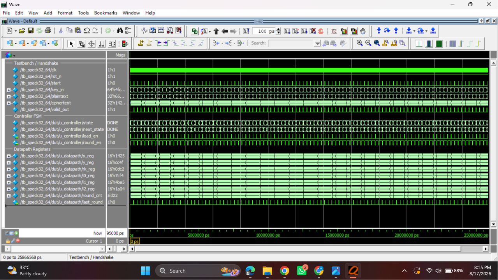

# SPECK32/64 Lightweight Block Cipher — Datapath + Controller (SystemVerilog)

A synthesizable RTL implementation of **SPECK32/64**, NSA's lightweight ARX
(Add–Rotate–XOR) block cipher: 32-bit block, 64-bit key, 22 rounds. Built as
a datapath + FSM controller pair with a clean `start` / `valid_out`
handshake, verified against a Python golden model.

```
key_in[63:0] ─┐
plaintext[31:0]┤   ┌──────────────┐
start ─────────┼──►│ speck32_64_top│──► ciphertext[31:0]
clk, rst_n ────┘   └──────────────┘──► valid_out
```

## Status

✅ 101/101 test vectors passing (1 mandatory official vector + 100 random
vectors from the golden model)
✅ Zero warnings under `verilator --lint-only -Wall`
✅ Verified against edge cases: held `start`, async reset mid-round,
back-to-back operations, output stability while idle in `DONE`

## Repository Structure

```
speck32_64/
├── README.md
├── docs/
│   ├── SPECK32_64_Project_Problem_Statement.pdf   # original spec
│   ├── diagram/
│   │   ├── speck32_64_architecture.drawio         # editable source
│   │   └── speck32_64_architecture.png            # exported diagram
│   └── results/
│       ├── questasim_waveform.png                 # round-by-round waveform
│       └── questasim_console_pass.png             # PASS/FAIL summary log
├── src/
│   ├── speck_datapath.sv       # registers, rotators, adders, XORs, key schedule
│   ├── speck_controller.sv     # FSM: IDLE → LOAD → ROUND ×22 → DONE
│   └── speck32_64_top.sv       # top-level, wires controller + datapath
├── tb/
│   ├── tb_speck32_64.sv        # self-checking testbench (mandatory + random vectors)
│   └── tb_stress.sv            # edge-case tests (held start, mid-op reset, DONE stability)
├── sim/
│   ├── run.do                  # QuestaSim compile + simulate script
│   └── speck_test_vectors.txt  # generated by golden_model.py (100 random vectors)
└── scripts/
    └── golden_model.py         # Python reference model / test-vector generator
```

## Architecture


The design is split into two blocks, per the project spec:

- **Datapath** (`speck_datapath.sv`) — all storage and arithmetic. Holds
  `X_reg`, `Y_reg` (the 32-bit block), `RK_reg` (current round key),
  `L0_reg/L1_reg/L2_reg` (a 3-word sliding window over the key schedule's
  `l[]` sequence), and a 5-bit `round_cnt`.
- **Controller** (`speck_controller.sv`) — a 4-state Moore FSM that
  sequences the datapath and drives the `start` / `valid_out` handshake.

### Design decisions

| Decision | Choice | Why |
|---|---|---|
| Shared ALU vs. two parallel round units | **Two parallel units** (one for encryption, one for key schedule) | SPECK's word size (16 bits) makes a second adder/rotator effectively free in area. Running both in parallel keeps the controller to a single `ROUND` state — no extra muxing or cycles to arbitrate a shared unit between the data round and key expansion. |
| Key schedule: upfront vs. on-the-fly | **On-the-fly**, one round key generated per cycle alongside encryption | Avoids a separate pre-computation phase (which would cost 21 extra cycles before encryption could start) and avoids storing all 22 round keys in a register array — `RK_reg` + a 3-word sliding window is enough. |

### FSM

| State | `load_en` | `round_en` | `valid_out` | Transition |
|---|---|---|---|---|
| `IDLE`  | 0 | 0 | 0 | `start=1` → `LOAD`, else self-loop |
| `LOAD`  | 1 | 0 | 0 | → `ROUND` (unconditional, 1 cycle) |
| `ROUND` | 0 | 1 | 0 | `round_cnt<21` self-loop; `round_cnt=21` → `DONE` (22 cycles total) |
| `DONE`  | 0 | 0 | 1 | `start=1` → `LOAD` (back-to-back op), else self-loop |

Latency: 1 (`LOAD`) + 22 (`ROUND`) = **23 cycles** from `start` sampled to
`valid_out`. Back-to-back throughput is also 23 cycles/operation, since
`DONE → LOAD` requires no idle cycle.

## Algorithm Parameters

| Parameter | Value |
|---|---|
| Word size (n) | 16 bits |
| Block | (x, y), two 16-bit words |
| Key | (k₃, k₂, k₁, k₀), four 16-bit words |
| Rounds (T) | 22 |
| Right rotation (α) | 7 |
| Left rotation (β) | 2 |

Round function, for `i = 0 … 21`:
```
x_(i+1) = ( ROTR(x_i, 7) + y_i ) XOR k_i
y_(i+1) = ROTL(y_i, 2) XOR x_(i+1)
```

Key schedule, `RK[0]=k0, l[0]=k1, l[1]=k2, l[2]=k3`, for `i = 0 … 20`:
```
l[i+3]  = ( ROTR(l[i], 7) + RK[i] ) XOR i
RK[i+1] = ROTL(RK[i], 2) XOR l[i+3]
```

## Top-Level Interface

```systemverilog
module speck32_64_top (
    input  logic        clk, rst_n,
    input  logic         start,
    input  logic [63:0] key_in,      // {k3,k2,k1,k0}
    input  logic [31:0] plaintext,   // {x0,y0}
    output logic [31:0] ciphertext,  // {x,y}
    output logic        valid_out
);
```

## Verification

1. **Golden model** (`scripts/golden_model.py`) — a bit-exact Python
   reference implementation. It self-checks against the mandatory official
   test vector before generating 100 random `(key, plaintext, ciphertext)`
   triples (fixed seed, reproducible) into `sim/speck_test_vectors.txt`.
2. **Mandatory vector**:
   `key=0x1918_1110_0908_0100`, `plaintext=0x6574_694c`,
   `expected ciphertext=0xa868_42f2`
3. **RTL testbench** (`tb/tb_speck32_64.sv`) — applies the mandatory vector
   plus all 100 random vectors through the `start`/`valid_out` handshake,
   self-checks each one, and prints a `TOTAL / PASS / FAIL` summary.
4. **Stress testbench** (`tb/tb_stress.sv`) — additional robustness checks
   beyond the mandatory suite: `start` held high across multiple cycles,
   asynchronous reset mid-round with clean recovery, and output stability
   while idling in `DONE`.

### Results




## How to Run

### Icarus Verilog

```bash
cd sim
python3 ../scripts/golden_model.py        # regenerate speck_test_vectors.txt (optional, already committed)
iverilog -g2012 -o sim \
    ../src/speck_datapath.sv ../src/speck_controller.sv ../src/speck32_64_top.sv \
    ../tb/tb_speck32_64.sv
vvp sim
```

### QuestaSim

```bash
cd sim
vsim -c -do run.do        # batch mode, console output only
# or
vsim -do run.do           # GUI mode with waveforms
```

### Lint (Verilator)

```bash
verilator --lint-only -Wall src/speck_datapath.sv src/speck_controller.sv src/speck32_64_top.sv
```

## Requirements

- SystemVerilog-2012 compliant simulator (Icarus Verilog ≥ 12.0, or QuestaSim/ModelSim)
- Python 3 (for `golden_model.py`)
- Verilator (optional, for linting)

## License

MIT — feel free to reuse for coursework or reference.
