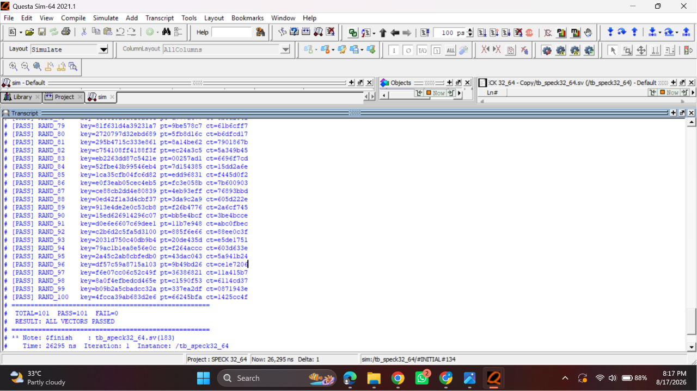

# SPECK32/64 Lightweight Block Cipher ---- Datapath + Controller (SystemVerilog)

A synthesizable RTL implementation of **SPECK32/64**, NSA's lightweight ARX
(Add–Rotate–XOR) block cipher: 32-bit block, 64-bit key, 22 rounds. Built as
a datapath + FSM controller pair with a clean `start` / `valid_out`
handshake, verified against a Python golden model.

```
key_in[63:0]  ─┐
plaintext[31:0]┤   ┌──────────────┐
start ─────────┼──►│speck32_64_top│──► ciphertext[31:0]
clk, rst_n ────┘   └──────────────┘──► valid_out
```

## Status

- 101 / 101 test vectors passing (1 mandatory official vector + 100
  random vectors generated by the golden model)
- Zero warnings under `verilator --lint-only -Wall`
- Verified against edge cases: `start` held high across multiple
  cycles, asynchronous reset mid-round, back-to-back operations with no
  idle gap, and output stability while parked in `DONE`
  
## Table of Contents

- [Repository Structure](#repository-structure)
- [Architecture](#architecture)
- [Algorithm Parameters](#algorithm-parameters)
- [Top-Level Interface](#top-level-interface)
- [Verification](#verification)
- [Results](#results)
- [How to Run](#how-to-run)
- [Requirements](#requirements)
- [Known Limitations & Future Work](#known-limitations--future-work)
- [Author](#author)
- [License](#license)

## Repository Structure

```
speck32_64/
├── README.md
├── docs/
│   ├── SPECK32_64_Project_Problem_Statement.pdf
│   ├── diagram/
│   │   ├── speck32_64_architecture.drawio
│   │   └── speck32_64_architecture.png
│   └── results/
│       ├── questasim_waveform.png
│       └── questasim_console_pass.png
├── src/
│   ├── speck_datapath.sv
│   ├── speck_controller.sv
│   └── speck32_64_top.sv
├── verif/
│   └── tb_speck32_64.sv
└── scripts/
    ├── run.do
    ├── speck_test_vectors.txt
    └── golden_model.py
```

## Architecture


The design is split into two blocks, per the project spec: a **datapath**
that holds all storage and arithmetic, and a **controller** that sequences
it through a full encryption.

### Datapath (`src/speck_datapath.sv`)

| Register | Width | Holds |
|---|---|---|
| `X_reg`, `Y_reg` | 16 b each | Current block words `(x, y)` |
| `RK_reg` | 16 b | Current round key `RK[round_cnt]` |
| `L0_reg`, `L1_reg`, `L2_reg` | 16 b each | 3-word sliding window over the key schedule's `l[]` sequence |
| `round_cnt` | 5 b | Round index, `0 … 21` |

Two structurally identical round-function primitives — each just
`ROTR7 → ADD16 → XOR → ROTL2 → XOR` wired combinationally, no barrel
shifter or loop — run in parallel every cycle: one advances
`(X_reg, Y_reg)` using `RK_reg`, the other advances the key-schedule state
to produce `RK[i+1]` one cycle ahead of when the encryption unit needs it.

### Controller (`src/speck_controller.sv`)

A 4-state Moore FSM drives the datapath's `load_en` / `round_en` control
lines and the top-level `start` / `valid_out` handshake:

| State | `load_en` | `round_en` | `valid_out` | Transition |
|---|---|---|---|---|
| `IDLE`  | 0 | 0 | 0 | `start=1` → `LOAD`, else self-loop |
| `LOAD`  | 1 | 0 | 0 | → `ROUND` (unconditional, 1 cycle) |
| `ROUND` | 0 | 1 | 0 | `round_cnt<21` self-loop; `round_cnt=21` → `DONE` (22 cycles total) |
| `DONE`  | 0 | 0 | 1 | `start=1` → `LOAD` (accepts next op back-to-back), else self-loop |

**Latency:** 1 (`LOAD`) + 22 (`ROUND`) = **23 cycles** from `start` being
sampled to `valid_out` going high. Back-to-back throughput is also 23
cycles/operation, since `DONE → LOAD` requires no idle bubble.

### Design decisions

| Decision | Choice | Rationale |
|---|---|---|
| Shared ALU vs. two parallel round units | **Two parallel units** — one for encryption, one for key schedule | SPECK's 16-bit word size makes a second adder/rotator essentially free in area. Running both in parallel keeps the controller to a single `ROUND` state, with one round completed per clock and no extra muxing or cycles spent arbitrating a shared unit between the data round and the key expansion. |
| Key schedule: upfront vs. on-the-fly | **On-the-fly**, one round key produced per cycle alongside encryption | Avoids a separate 21-cycle pre-computation phase before encryption can even begin, and avoids storing all 22 round keys in a register array — `RK_reg` plus a 3-word sliding window (`L0/L1/L2_reg`) is all the state the key schedule needs at any point in time. |

## Algorithm Parameters

| Parameter | Value |
|---|---|
| Word size (n) | 16 bits |
| Block | `(x, y)`, two 16-bit words |
| Key | `(k₃, k₂, k₁, k₀)`, four 16-bit words |
| Rounds (T) | 22 |
| Right rotation (α) | 7 |
| Left rotation (β) | 2 |

**Round function**, for `i = 0 … 21`, with round key `k_i`:

```
x_(i+1) = ( ROTR(x_i, 7) + y_i ) XOR k_i
y_(i+1) = ROTL(y_i, 2) XOR x_(i+1)
```

`+` is addition mod 2¹⁶ (carry-out discarded); ciphertext is `(x, y)`
after round 21.

**Key schedule**, `RK[0] = k0`, `l[0] = k1`, `l[1] = k2`, `l[2] = k3`, for
`i = 0 … 20`:

```
l[i+3]  = ( ROTR(l[i], 7) + RK[i] ) XOR i
RK[i+1] = ROTL(RK[i], 2) XOR l[i+3]
```

## Top-Level Interface

```systemverilog
module speck32_64_top (
    input  logic        clk, rst_n,
    input  logic         start,
    input  logic [63:0] key_in,      // {k3,k2,k1,k0}
    input  logic [31:0] plaintext,   // {x0,y0}
    output logic [31:0] ciphertext,  // {x,y}
    output logic        valid_out
);
```

`start` is a single-cycle pulse that latches `key_in` / `plaintext` and
begins the 23-cycle encryption; `valid_out` goes high for as long as the
core sits in `DONE`, and `ciphertext` is held stable on `X_reg`/`Y_reg`
until the next `start`.

## Verification

1. **Golden model** (`scripts/golden_model.py`) — a bit-exact Python
   reference implementation. It self-checks against the mandatory official
   test vector before generating 100 random `(key, plaintext, ciphertext)`
   triples (fixed seed, reproducible) into `sim/speck_test_vectors.txt`.
2. **Mandatory vector**:
   `key=0x1918_1110_0908_0100`, `plaintext=0x6574_694c`,
   `expected ciphertext=0xa868_42f2`
3. **RTL testbench** (`tb/tb_speck32_64.sv`) — applies the mandatory vector
   plus all 100 random vectors through the `start`/`valid_out` handshake,
   self-checks each one, and prints a `TOTAL / PASS / FAIL` summary.
4. **Stress testbench** (`tb/tb_stress.sv`) — additional robustness checks
   beyond the mandatory suite: `start` held high across multiple cycles,
   asynchronous reset mid-round with clean recovery, and output stability
   while idling in `DONE`.

### Results



## Sample Simulation Output

```
[PASS] official vector: key=1918111009080100 pt=6574694c expected=a86842f2 actual=a86842f2
[PASS] vector 001: key=... pt=... ct=...
...
[PASS] vector 100: key=... pt=... ct=...
----------------------------------------------------
TOTAL=101  PASS=101  FAIL=0
RESULT: ALL VECTORS PASSED
----------------------------------------------------
```

## How to Run

### QuestaSim

```bash
cd sim
vsim -c -do run.do        # batch mode, console output only
# or
vsim -do run.do           # GUI mode with waveforms
```

### Icarus Verilog

```bash
cd sim
python3 ../scripts/golden_model.py        # regenerate speck_test_vectors.txt (optional, already committed)
iverilog -g2012 -o sim \
    ../src/speck_datapath.sv ../src/speck_controller.sv ../src/speck32_64_top.sv \
    ../tb/tb_speck32_64.sv
vvp sim
```

### Lint (Verilator)

```bash
verilator --lint-only -Wall src/speck_datapath.sv src/speck_controller.sv src/speck32_64_top.sv
```

## Requirements

- SystemVerilog-2012 compliant simulator (Icarus Verilog ≥ 12.0, or QuestaSim/ModelSim)
- Python 3 (for `golden_model.py`)
- Verilator (optional, for linting)

## Known Limitations & Future Work

- The key-schedule unit computes one extra, unused round key update on the
  final round (`round_cnt=21`), since it isn't gated by `last_round`. It's
  harmless — the value is discarded — but could be trimmed by qualifying
  the key-schedule register enables with `round_en && !last_round`.
- No `busy` output is exposed; a caller must track the handshake via
  `valid_out` alone (sufficient per the spec, but a `busy` flag would make
  back-to-back scheduling easier for an external controller).
- Only SPECK32/64 is implemented. The datapath's word size, rotation
  amounts, and round count are hardcoded rather than parameterized, so
  extending to other SPECK variants (e.g. SPECK64/128) would require
  reworking constants rather than just changing a parameter.

## Author

Ali Ahsan — built as a 2-day RTL design exercise (datapath + controller
architecture for a round-based cipher), per the attached project brief.

## License

This project is licensed under the terms of the [MIT License](LICENSE).
